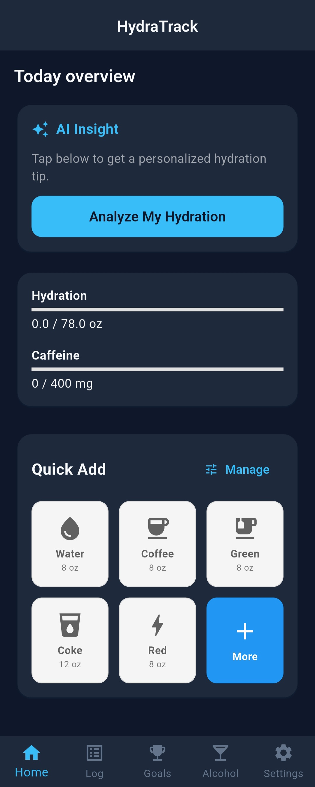
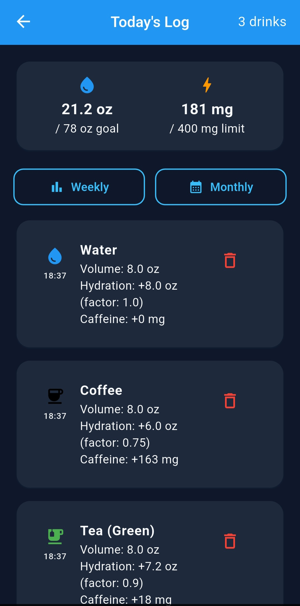
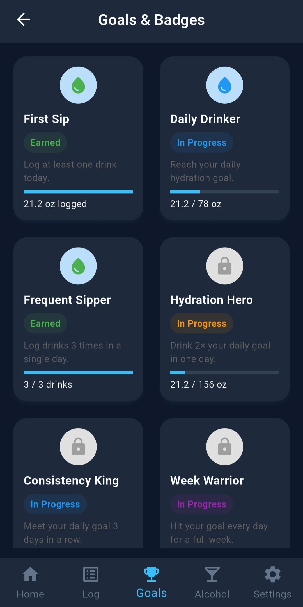
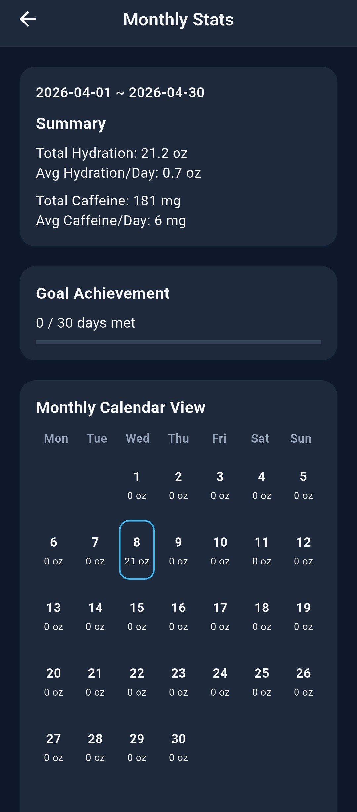

# HydraTrack

**Smarter hydration tracking — not just fluid volume.**

> 🌐 Website & Tutorial: **[wynter106.github.io/HydraTrack](https://wynter106.github.io/HydraTrack/)**  
> 📱 Download APK: **[Google Drive](https://drive.google.com/uc?export=download&id=1wfZt2eirbZEF-Ru0Nwcwn8dekk1CB4uR)**

Most hydration apps treat every drink the same. HydraTrack applies a **Beverage Hydration Index** to each drink — coffee contributes less toward your daily goal than water, and an energy drink even less. The result is a more accurate picture of actual hydration, not just the total fluid consumed.

Built as a CS 4500 Senior Design Capstone project at the University of Utah, Spring 2026.

---

## Screenshots

| Home | Today's Log | Goals & Badges | Monthly Stats |
|------|-------------|----------------|---------------|
|  |  |  |  |

---

## Features

- **Hydration Factor** — each drink weighted by its real hydration contribution (accounting for caffeine diuretic effect)
- **Caffeine Tracking** — daily limit with real-time progress and warnings
- **Alcohol Tracking** — standard drink calculation with 100+ alcoholic beverages
- **AI Daily Insight** — personalized hydration tip generated from your day's data (Groq / LLaMA 3)
- **Drink Library** — 630+ beverages, fully searchable with A–Z sidebar, favorites, and Quick Add
- **Weekly & Monthly Stats** — calendar heat-map view of daily goal achievement
- **Goals & Badges** — streak tracking and milestone achievements
- **Medication Reminders** — scheduled push notifications (Android & iOS)
- **Offline Support** — logs queued locally and synced on reconnect
- **Dark Mode** and **oz / mL unit toggle**

---

## Platform

| Platform | Support |
|----------|---------|
| Android | ✅ Primary target (API 21+) |
| iOS | ✅ Supported (iOS 13+) |
| Web / Desktop | ❌ Not supported |

The app is developed and tested primarily on Android. iOS builds require a Mac with Xcode installed.

---

## Tech Stack

| Layer | Technology |
|-------|-----------|
| Framework | Flutter 3.x (Dart 3.x) |
| Authentication & Cloud DB | Supabase |
| Local DB | SQLite via `sqflite` (630+ beverage seed data) |
| State Management | Provider |
| Offline Cache | `shared_preferences` + local JSON queue |
| AI Analysis | Groq API (`llama-3.3-70b-versatile`) |
| Push Notifications | `flutter_local_notifications` |
| Connectivity | `connectivity_plus` |

### Key Dependencies (`pubspec.yaml`)

| Package | Purpose |
|---------|---------|
| `supabase_flutter` | Cloud auth and database |
| `sqflite` | Local SQLite database |
| `provider` | State management |
| `shared_preferences` | Persistent local key-value storage |
| `flutter_local_notifications` | Push notification scheduling |
| `connectivity_plus` | Network connectivity detection |
| `http` | HTTP requests to Groq AI API |
| `intl` | Date/time formatting and localization |
| `flutter_svg` | SVG icon rendering |
| `timezone` | Timezone-aware notification scheduling |

---

## Team

| Name | Responsibilities |
|------|-----------------|
| Wynter Kim | Team lead, database design, Supabase architecture, core tracking logic, AI feature |
| Douglas Maughan | Log screen UI, analytics screens, alcohol tracking |
| JungBin Moon | UI/UX, theming, weekly/monthly calendar view, medication reminder feature |
| Wilker Gonzalez | Settings, goals & badges, alcohol tracking, dark mode |

---

## Getting Started

### Prerequisites

Before running the project, ensure you have the following installed:

- **Flutter SDK 3.x** — [flutter.dev/docs/get-started/install](https://flutter.dev/docs/get-started/install)
- **Dart 3.x** (included with Flutter)
- **Android Studio** or **VS Code** with Flutter/Dart extensions
- **Android SDK** (for Android builds) or **Xcode** (for iOS builds, macOS only)
- A **Supabase** project — [supabase.com](https://supabase.com) (free tier works)
- A **Groq API key** — [console.groq.com](https://console.groq.com) (free tier works)

### 1. Clone the Repository

```bash
git clone https://capstone.cs.utah.edu/hydratrack/hydratrack.git
cd hydratrack
```

### 2. Configure API Keys

Create the secrets file at `lib/config/secrets.dart` (this file is gitignored and must be created manually):

```dart
// lib/config/secrets.dart
const String groqApiKey = 'YOUR_GROQ_API_KEY_HERE';
```

Create the Android signing config at `android/key.properties` (required for release builds only):

```properties
storePassword=YOUR_STORE_PASSWORD
keyPassword=YOUR_KEY_PASSWORD
keyAlias=YOUR_KEY_ALIAS
storeFile=YOUR_KEYSTORE_PATH
```

> **Note:** Both `lib/config/secrets.dart` and `android/key.properties` are gitignored. They must be created locally and should never be committed.

### 3. Configure Supabase

The Supabase URL and anon key are configured in `lib/main.dart`. Update the following values with your Supabase project credentials:

```dart
await Supabase.initialize(
  url: 'YOUR_SUPABASE_URL',
  anonKey: 'YOUR_SUPABASE_ANON_KEY',
);
```

The required Supabase tables and schema are documented in `DEVELOPMENT.md`.

### 4. Install Dependencies

```bash
flutter pub get
```

### 5. Run the App

```bash
# List connected devices
flutter devices

# Run on a connected device or emulator
flutter run -d <device-id>

# Run in debug mode on the first available device
flutter run
```

---

## Building

### Debug APK (Android)

```bash
flutter build apk --debug
```

Output: `build/app/outputs/flutter-apk/app-debug.apk`

### Release APK (Android)

Requires `android/key.properties` to be configured (see step 2 above).

```bash
flutter build apk --release
```

Output: `build/app/outputs/flutter-apk/app-release.apk`

### iOS Build (macOS only)

```bash
flutter build ios
```

Open `ios/Runner.xcworkspace` in Xcode to archive and distribute.

---

## Testing

```bash
# Run all unit tests
flutter test

# Run static analysis
flutter analyze

# Run analysis (suppress info-level hints)
flutter analyze --no-fatal-infos --no-fatal-warnings
```

Tests are located in the `test/` directory. The primary test suite covers the business logic calculators (`MonthlyStatsCalculator`, `HydrationCalculator`, etc.).

---

## Architecture

The project follows a 4-layer architecture:

```
Presentation Layer    →  lib/presentation/screens/
                          lib/presentation/widgets/
Application Layer     →  lib/application/providers/
Business Logic Layer  →  lib/business/calculators/
                          lib/business/services/
                          lib/business/managers/
Data Layer            →  lib/data/dao/
                          lib/data/models/
```

See [DEVELOPMENT.md](DEVELOPMENT.md) for detailed architecture notes, feature status, known issues, and key engineering decisions.

---

## Continuous Integration

This project uses GitLab CI (`.gitlab-ci.yml`) and GitHub Actions (`.github/workflows/`) for automated analysis and testing on every push to `main`.

CI pipeline runs:
1. `flutter pub get`
2. `flutter analyze --no-fatal-infos --no-fatal-warnings`
3. `flutter test`

---

## Disclaimer

HydraTrack is a **wellness and habit-building tool**, not a medical application. Hydration factors are simplified approximations intended to encourage healthier drink choices, not precise physiological measurements. Users with specific health conditions should consult a healthcare professional.

| Drink type | Hydration factor (approx.) |
|------------|---------------------------|
| Water | 1.00 |
| Tea / Light coffee | 0.90–0.95 |
| Regular coffee | 0.80–0.85 |
| Strong coffee | 0.75 |
| Energy drink | 0.60–0.70 |
